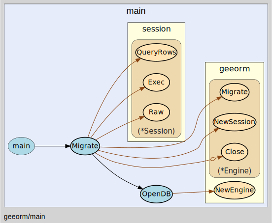

# go-orm

go-orm 是在阅读 [gee-orm](https://github.com/geektutu/7days-golang/tree/master/gee-orm) 源码时的一些注解。

该框架由如下几部分构成，分别为 :
- clause  : 实现了各个sql子句的生成。
- dialect : 实现数据类型转换,即如何将 go 的类型转换为特定数据库驱动的类型。
- scheme  : 实现go结构体与数据表的转换，包含表名转换，字段转换，结构体约束转换等。
- session : 提供了操作数据库的接口，负责与数据库进行交互、表的增/删操作实现在 session 中。
- geeorm  : 负责用数据库链接，链接成功后, 将该链接交给 Session 进行后续与数据库的交互。

接下来通过图片的方式， 给出各个组件的模块和构成。

# 整体流程
入口文件为 `main/main.go`, 我们以实现一个数据库迁移来观察整个框架的运行流程。
```go
package main

import (
	"geeorm"
	"geeorm/log"
	"reflect"
)

type User struct {
	Name string `geeorm:"PRIMARY KEY"`
	Age  int
}

func main()  {
	Migrate()
}

//Migrate 实现数据库迁移
func Migrate() {
	engine := OpenDB()
	defer engine.Close()
	s := engine.NewSession()
	_, _ = s.Raw("DROP TABLE IF EXISTS User;").Exec()
	_, _ = s.Raw("CREATE TABLE User(Name text PRIMARY KEY, XXX integer);").Exec()
	_, _ = s.Raw("INSERT INTO User(`Name`) values (?), (?)", "Tom", "Sam").Exec()
	engine.Migrate(&User{})

	rows, _ := s.Raw("SELECT * FROM User").QueryRows()
	columns, _ := rows.Columns()
	if !reflect.DeepEqual(columns, []string{"Name", "Age"}) {
		log.Error("Failed to migrate table User, got columns", columns)
	}
}

//OpenDB 实例化 Engine
func OpenDB() *geeorm.Engine {
	engine, err := geeorm.NewEngine("sqlite3", "gee.db")
	if err != nil {
		log.Error("failed to connect", err)
	}
	return engine
}
```

可以看到先是通过 OpenDB 实现化 Engine 获取数据库连接，之后通过 NewSession() 将数据库连接交给 Session 对象，最后就是数据表的增删查改了。




# Engine

Engine 首先通过 NewEngine() 来实例化，通过传入具体的数据库驱动(sqlite,mysql...) 给 dialect.GetDialect(driver) 
来获取数据库类型和go数据类型间的映射关系，至此 Engine 对象构造完毕。

之后的数据库的操作，例如 `migrate`、`事务`、`增删查改`之类的都交给 Session 处理了。 


# Session

对于 `Session` 的操作起源于 Engine 中的 `NewSession()`, Session 我们前文中说过，它负责与数据库的具体交互，是整个 orm 框架的核心组件。

它的核心包含三部分：
1. 数据表的管理，以及迁移。
2. 数据记录的增删改差。
3. 事务处理。


# Schema 和 Dialect

在分析 Session 的调用流程图中，我们看到 Session 依赖了 Dialect 和 Schema , 因为对于任何一个 orm 框架来说，与具体的驱动交互需要处理两件事：
1. 数据类型转换：go 中的数据类型如何转换为对应驱动的数据类型，例如字符串类型在不同的数据库中的定义不同，有的叫`varchar`， 有的叫 `text`。
2. 数据表字段转换： 如何将结构体的字段转换为对应的数据表字段，以及如何添加`主键`，`索引`一类的约束条件。

答案就在 Dialect 和 Schema 中，前者处理go类型和数据库类型的转换关系，后者处理结构体和数据表字段的转换关系。

**Dialect**


**Schema**


# Clause

Clause 实现了各个 sql 子句 ，Clause 翻译为`方言`, 这个命名可以是取的非常形象，因为不同的数据库其底层的 `sql语句` 都不一样，都有着自己的`方言`。


